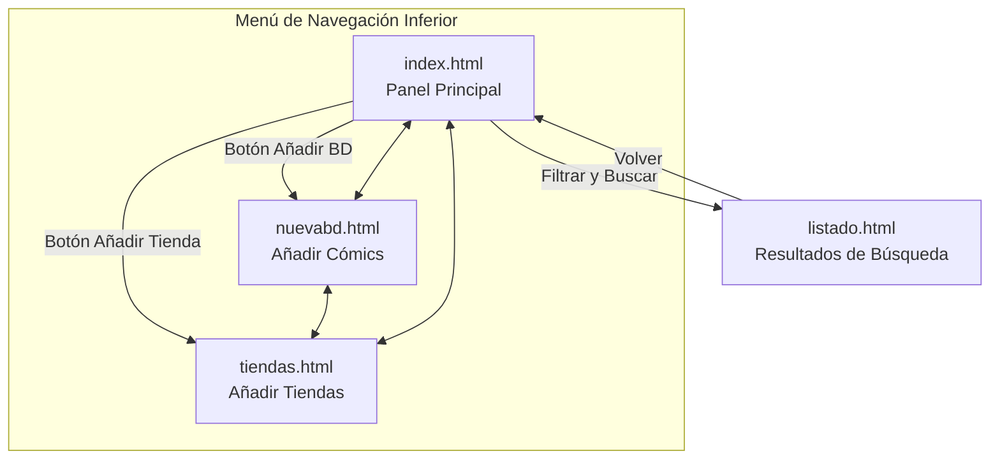

# BD Tracker 📚

**BD Tracker** es una aplicación web (PWA) diseñada para gestionar tu colección de cómics (BD) y tu repertorio de tiendas favoritas. La interfaz está optimizada para dispositivos móviles y cuenta con una estética moderna basada en *glassmorphism*.

## 🚀 Navegación y Relación entre Páginas

A continuación se detalla cómo se relacionan las diferentes secciones de la aplicación:

### Descripción de las Páginas

*   **`index.html` (Dashboard):** El punto de entrada. Muestra estadísticas generales (total de tomos, cómics en propiedad, número de tiendas) y ofrece potentes filtros para consultar tu colección.
*   **`listado.html` (Resultados):** Muestra una tabla detallada con los cómics filtrados desde el panel principal. Permite ver el estado de cada tomo y si ya lo tienes en tu colección.
*   **`nuevabd.html` (Añadir BD):** Formulario para agregar nuevos títulos a la base de datos, incluyendo serie, autor, editorial y estado.
*   **`tiendas.html` (Añadir Tienda):** Formulario para registrar nuevas librerías o tiendas de cómics, organizadas por país y ciudad.

## 🛠️ Tecnologías Utilizadas

- **Frontend:** HTML5, CSS3 (Custom Properties).
- **Iconografía:** FontAwesome 7.0.1.
- **Tipografía:** League Spartan (vía Google Fonts).
- **Lógica:** JavaScript (Vanilla JS) con soporte para PWA (Manifest.json).
- **Idioma:** La interfaz y los datos están localizados en **Asturiano**.

## 📱 Instalación como PWA

Al contar con un archivo `manifest.json` y una configuración orientada a móviles, puedes instalar esta aplicación en tu pantalla de inicio desde el navegador de tu smartphone para usarla como una app nativa.
